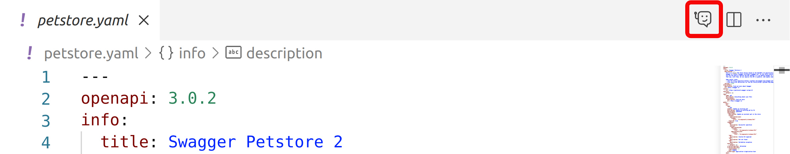
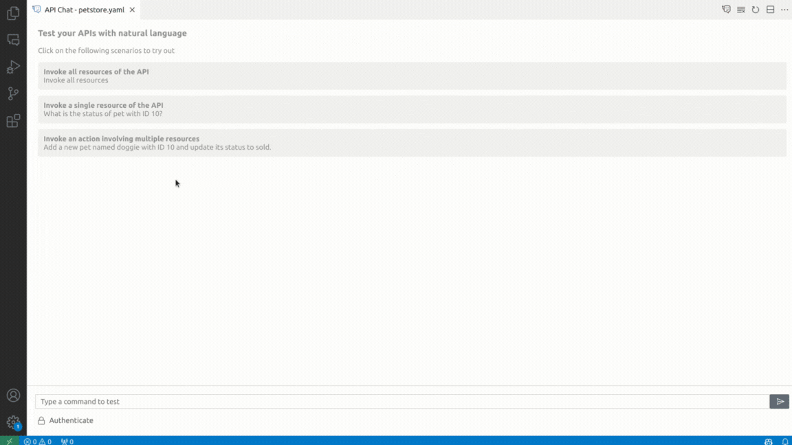
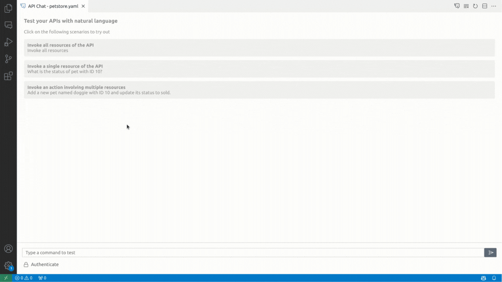

# API Chat for Visual Studio Code

Use natural language to interact with APIs that have an OpenAPI description. Just describe a scenario to the API Chat extension in VS Code, and it intelligently selects and calls the relevant resources for you.

## Usage

1. Open an OpenAPI YAML file in Visual Studio Code.
2. Click the `Open API Chat` button to open the API Chat Test Console.

Now, you are ready to use API Chat to test your API with the support of natural language and AI.

### Tryout using already available commands

1. With the API Chat Console open, use any of the available commands in the Console to try out the API.

### Tryout by Typing a Command in Natural Language

1. With the Test Console open, simply type your command in natural language, and API Chat will understand and execute it.

### Authenticate with API

1. Authenticate using one of the following authentication types:
   - **Basic Authorization:** This method uses a username and password for authentication.
   - **Authorization Bearer:** Authenticate using an authorization bearer token.
   - **API Key:** Provide an API key for authentication.
   

## Feedback and Support

We welcome your feedback and suggestions for improving the API Chat VS Code extension. If you encounter any issues or have questions, please [create a GitHub issue](https://github.com/wso2/api-chat-vscode/issues) to reach out to us.

Happy testing with API Chat!
